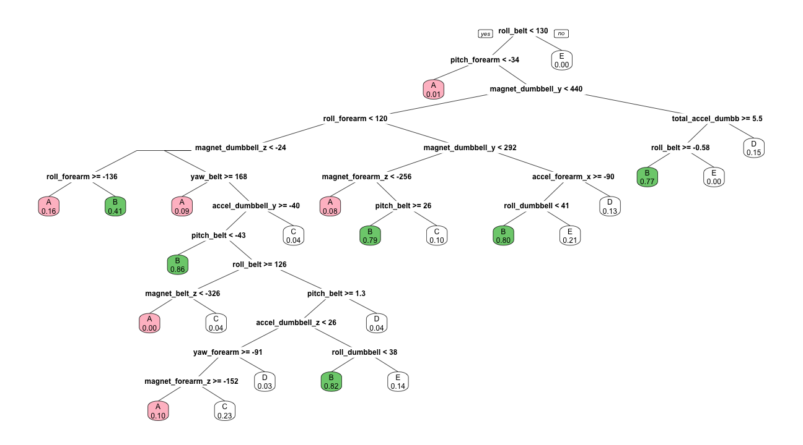
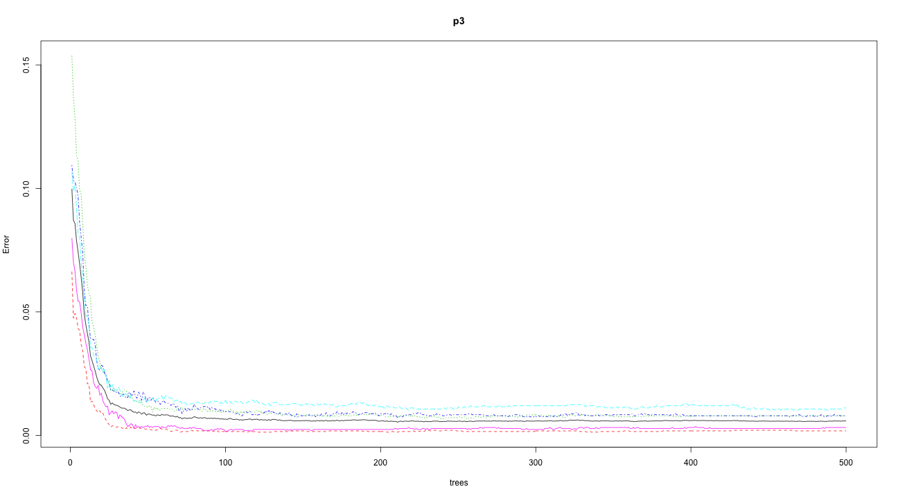
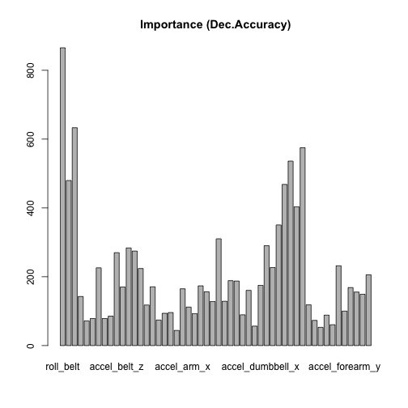

# Personal Activity Prediction From Machine Learning Techniques
===============================================================

## Executive Summary
The goal of this exercise is to use the reading from several sensory data from accelerometers on the belt, forearm, arm, and dumbell of 6 participants, and to predict the outcome of the manner in which they did the exercise. This outcome is denoted by classe variable in the dataset. These participants were further asked to perform barbell lifts correctly and incorrectly in 5 different ways. More information is available from the website here: http://groupware.les.inf.puc-rio.br/har (see the section on the Weight Lifting Exercise Dataset).
We have surveyed different machine learning techniques and concluded that Random Forest was the best model for predicting the manner in which the participants did the exercise.

## Data Loading

We download the dataset and store it in directory provided these datasets are already not downloaded in the R work directory before.

<pre class="knitr r">setwd("/Users/uthrakartik/fitbit")
</pre>

<pre class="knitr r"># Download training data if already not download
if (!file.exists("training.csv")){
# URL of Dataset
   fileURL1<-"https://d396qusza40orc.cloudfront.net/predmachlearn/pml-training.csv"
# downloads the zipped file and renames it to something simple(dataset.zip)
   download.file(fileURL1,destfile="training.csv",method="curl")
# Date stamp the data downloaded
   dateDownloaded<-date()
}

# Download testing data if already not download
if (!file.exists("testing.csv")){
# URL of Dataset
   fileURL2<-"https://d396qusza40orc.cloudfront.net/predmachlearn/pml-testing.csv"
# downloads the zipped file and renames it to something simple(dataset.zip)
   download.file(fileURL2,destfile="testing.csv",method="curl")
# Date stamp the data downloaded
   dateDownloaded<-date()
}
</pre>

## Data Pre-processing and Feature Selection
During pre-processing we read the testing and training datasets with read.csv functions. We removed variables that are not sensor measures and that consist mostly of NAs and blanks. Since the goal of this exercise is to build a prediction model based on sensor measurements we also ignore the columns that arent relevant to any sensory values. 

<pre class="knitr r"># read training dataset for pre-processing
finaltraining <- read.csv("training.csv", header = T, na.strings = c("NA", ""))
# read testing dataset for pre-processing
finaltesting <- read.csv("testing.csv", header = T, na.strings = c("NA", ""))
# remove columns from training set that consist mostly of NAs and blanks
finaltraining  <- finaltraining[, colSums(!is.na(finaltraining)) == nrow(finaltraining)]
# also remove other columns that actually do not sensor measurements
finaltraining <- subset(finaltraining, select = -c(X, user_name, raw_timestamp_part_1, raw_timestamp_part_2,cvtd_timestamp, new_window, num_window))
finaltesting  <- finaltesting[, colSums(!is.na(finaltesting)) == nrow(finaltesting)]
# also remove other columns that actually do not sensor measurements
finaltesting <- subset(finaltesting, select = -c(X, user_name, raw_timestamp_part_1, raw_timestamp_part_2,cvtd_timestamp, new_window, num_window))
</pre>

If we introspect on our finaltesting data, there is no classe variable which is the outcome for our prediction model. If we try to build a model around our finaltraining data we wont be able to evaluate the accuracy of our modellers. We we divide our finaltraining into 2 pieces: a training and a validation dataframe.

<pre class="knitr r">set.seed(1)
library(caret)
inTrain <- createDataPartition(y = finaltraining$classe, p = 0.7, list = FALSE)
training <- finaltraining[inTrain, ]  #13737 obs.
validation <- finaltraining[-inTrain, ]  #5885 obs.   
</pre>

Here is our final partitioned tidy dataset (13737 obs. of  53 variables) that contains the measurements data from only sensors that we can use it to build our prediction model upon. 

<pre class="knitr r">str(training)
</pre>

<pre class="knitr r">## 'data.frame':	13737 obs. of  53 variables:
##  $ roll_belt           : num  1.41 1.42 1.48 1.48 1.42 1.42 1.43 1.45 1.45 1.43 ...
##  $ pitch_belt          : num  8.07 8.07 8.05 8.07 8.09 8.13 8.16 8.17 8.18 8.18 ...
##  $ yaw_belt            : num  -94.4 -94.4 -94.4 -94.4 -94.4 -94.4 -94.4 -94.4 -94.4 -94.4 ...
##  $ total_accel_belt    : int  3 3 3 3 3 3 3 3 3 3 ...
##  $ gyros_belt_x        : num  0.02 0 0.02 0.02 0.02 0.02 0.02 0.03 0.03 0.02 ...
##  $ gyros_belt_y        : num  0 0 0 0.02 0 0 0 0 0 0 ...
##  $ gyros_belt_z        : num  -0.02 -0.02 -0.03 -0.02 -0.02 -0.02 -0.02 0 -0.02 -0.02 ...
##  $ accel_belt_x        : int  -22 -20 -22 -21 -22 -22 -20 -21 -21 -22 ...
##  $ accel_belt_y        : int  4 5 3 2 3 4 2 4 2 2 ...
##  $ accel_belt_z        : int  22 23 21 24 21 21 24 22 23 23 ...
##  $ magnet_belt_x       : int  -7 -2 -6 -6 -4 -2 1 -3 -5 -2 ...
##  $ magnet_belt_y       : int  608 600 604 600 599 603 602 609 596 602 ...
##  $ magnet_belt_z       : int  -311 -305 -310 -302 -311 -313 -312 -308 -317 -319 ...
##  $ roll_arm            : num  -128 -128 -128 -128 -128 -128 -128 -128 -128 -128 ...
##  $ pitch_arm           : num  22.5 22.5 22.1 22.1 21.9 21.8 21.7 21.6 21.5 21.5 ...
##  $ yaw_arm             : num  -161 -161 -161 -161 -161 -161 -161 -161 -161 -161 ...
##  $ total_accel_arm     : int  34 34 34 34 34 34 34 34 34 34 ...
##  $ gyros_arm_x         : num  0.02 0.02 0.02 0 0 0.02 0.02 0.02 0.02 0.02 ...
##  $ gyros_arm_y         : num  -0.02 -0.02 -0.03 -0.03 -0.03 -0.02 -0.03 -0.03 -0.03 -0.03 ...
##  $ gyros_arm_z         : num  -0.02 -0.02 0.02 0 0 0 -0.02 -0.02 0 0 ...
##  $ accel_arm_x         : int  -290 -289 -289 -289 -289 -289 -288 -288 -290 -288 ...
##  $ accel_arm_y         : int  110 110 111 111 111 111 109 110 110 111 ...
##  $ accel_arm_z         : int  -125 -126 -123 -123 -125 -124 -122 -124 -123 -123 ...
##  $ magnet_arm_x        : int  -369 -368 -372 -374 -373 -372 -369 -376 -366 -363 ...
##  $ magnet_arm_y        : int  337 344 344 337 336 338 341 334 339 343 ...
##  $ magnet_arm_z        : int  513 513 512 506 509 510 518 516 509 520 ...
##  $ roll_dumbbell       : num  13.1 12.9 13.4 13.4 13.1 ...
##  $ pitch_dumbbell      : num  -70.6 -70.3 -70.4 -70.4 -70.2 ...
##  $ yaw_dumbbell        : num  -84.7 -85.1 -84.9 -84.9 -85.1 ...
##  $ total_accel_dumbbell: int  37 37 37 37 37 37 37 37 37 37 ...
##  $ gyros_dumbbell_x    : num  0 0 0 0 0 0 0 0 0 0 ...
##  $ gyros_dumbbell_y    : num  -0.02 -0.02 -0.02 -0.02 -0.02 -0.02 -0.02 -0.02 -0.02 -0.02 ...
##  $ gyros_dumbbell_z    : num  0 0 -0.02 0 0 0 0 0 0 0 ...
##  $ accel_dumbbell_x    : int  -233 -232 -232 -233 -232 -234 -232 -235 -233 -233 ...
##  $ accel_dumbbell_y    : int  47 46 48 48 47 46 47 48 47 47 ...
##  $ accel_dumbbell_z    : int  -269 -270 -269 -270 -270 -272 -269 -270 -269 -270 ...
##  $ magnet_dumbbell_x   : int  -555 -561 -552 -554 -551 -555 -549 -558 -564 -554 ...
##  $ magnet_dumbbell_y   : int  296 298 303 292 295 300 292 291 299 291 ...
##  $ magnet_dumbbell_z   : num  -64 -63 -60 -68 -70 -74 -65 -69 -64 -65 ...
##  $ roll_forearm        : num  28.3 28.3 28.1 28 27.9 27.8 27.7 27.7 27.6 27.5 ...
##  $ pitch_forearm       : num  -63.9 -63.9 -63.9 -63.9 -63.9 -63.8 -63.8 -63.8 -63.8 -63.8 ...
##  $ yaw_forearm         : num  -153 -152 -152 -152 -152 -152 -152 -152 -152 -152 ...
##  $ total_accel_forearm : int  36 36 36 36 36 36 36 36 36 36 ...
##  $ gyros_forearm_x     : num  0.02 0.03 0.02 0.02 0.02 0.02 0.03 0.02 0.02 0.02 ...
##  $ gyros_forearm_y     : num  0 -0.02 -0.02 0 0 -0.02 0 0 -0.02 0.02 ...
##  $ gyros_forearm_z     : num  -0.02 0 0 -0.02 -0.02 0 -0.02 -0.02 -0.02 -0.03 ...
##  $ accel_forearm_x     : int  192 196 189 189 195 193 193 190 193 191 ...
##  $ accel_forearm_y     : int  203 204 206 206 205 205 204 205 205 203 ...
##  $ accel_forearm_z     : int  -216 -213 -214 -214 -215 -213 -214 -215 -214 -215 ...
##  $ magnet_forearm_x    : int  -18 -18 -16 -17 -18 -9 -16 -22 -17 -11 ...
##  $ magnet_forearm_y    : num  661 658 658 655 659 660 653 656 657 657 ...
##  $ magnet_forearm_z    : num  473 469 469 473 470 474 476 473 465 478 ...
##  $ classe              : Factor w/ 5 levels "A","B","C","D",..: 1 1 1 1 1 1 1 1 1 1 ...
</pre>

## Predictive Modelling 
In this section we go through a series of predictive modelling tools, a.k.a. 1. Tree based modelling, 2. Bagging, 3. Random Forest and 4. Boosting and analyze the performance of these model in order to give us the best prediction algorithm for our dataset. The "classe" variable is the outcome variable where we build out training models. 

### Tree based modelling
A tree-based prediction method (e.g. CART) partitions the feature (variables) space into a set of rectangles, on which fixed constants (predictions) are assigned. We can use the rpart function in the rpart package, which implements CART. We also use prp to plot rplot trees with better rendering options.

<pre class="knitr r">library(rpart)
library(rpart.plot)
p1 <- rpart(classe ~ ., data = training)
prp(p1, extra=6, box.col=c("pink", "palegreen3")[p1$frame$yval])
</pre>

### Bagging
Bagging (Boostrap Aggregation) simply grows multiple trees, each tree growing on a different bootstrap sample. It then reports the majority vote or mean response (across all trees) as the prediction. We can use the bagging function in the ipred package. The coob option used below requests the out-of-bag estimate of the misclassification error.

<pre class="knitr r">library(ipred)
p2 <- bagging(classe ~ ., data = training, coob = T)
p2
</pre>

<pre class="knitr r">## 
## Bagging classification trees with 25 bootstrap replications 
## 
## Call: bagging.data.frame(formula = classe ~ ., data = training, coob = T)
## 
## Out-of-bag estimate of misclassification error:  0.0193
</pre>

### Random Forest
Random Forest injects additional randomness into the bagging procedure on trees: each node is split using the best among a subset of predictors randomly chosen at that node, instead of the full set. This prediction model usually provides superior performance and is robust against overfitting by keeping healthy SNR (signal to noise ratio). We make use of CRAN's randomForest library to use this prediction, and the plot method traces the error rates (out-of-bag, and by each response category) as the number of trees increases.

<pre class="knitr r">library(randomForest)
p3 <- randomForest(classe ~ ., data = training, importance = T)
p3
</pre>

<pre class="knitr r">## 
## Call:
##  randomForest(formula = classe ~ ., data = training, importance = T) 
##                Type of random forest: classification
##                      Number of trees: 500
## No. of variables tried at each split: 7
## 
##         OOB estimate of  error rate: 0.58%
## Confusion matrix:
##      A    B    C    D    E class.error
## A 3899    5    1    1    0    0.001792
## B   14 2637    7    0    0    0.007901
## C    0   15 2377    4    0    0.007930
## D    0    0   24 2227    1    0.011101
## E    0    0    2    6 2517    0.003168
</pre>

<pre class="knitr r">plot(p3)
</pre>

The importance option in the randomForest function requests the assessment of predictor importances. Here is the barplot containing global measure in the mean descrease in accuracy over all classes:

<pre class="knitr r"> barplot(p3$importance[, 7], main = "Importance (Dec.Accuracy)")
</pre>

## Testing Prediction Models
The prediction dataframe on the validation dataset sample for Tree, Bagging, and Random Forest is:

<pre class="knitr r">output<-data.frame(Truth = validation$classe, Tree = predict(p1, validation, type = "class"), Bagging = predict(p2, validation), Forest = predict(p3, validation))
sum(output$Truth==output$Tree);sum(output$Truth==output$Bagging);sum(output$Truth==output$Forest)
</pre>

<pre class="knitr r">## [1] 4380
</pre>

<pre class="knitr r">## [1] 5789
</pre>

<pre class="knitr r">## [1] 5866
</pre>

Note that the original validation set we had 5885 observations of 53 variables. As we can see RandomForest algorithm seemed to have done much better of predicting 5866 out of 5885 variables correctly among the other 2 algorithms. For more formal and accurate estimation of comparision of these algorithms, we go with error rate estimate of all three models.

### Error Rate Estimation

To compare the performances of different prediction tools, we can do a 10-fold cross validation to estimate the test error, using the errorest function in the ipred package.

<pre class="knitr r">library(ipred)
library(rpart)
library(randomForest)
mypredict.rpart <- function(object, newdata) {
predict(object, newdata = newdata, type = "class")
}

c(Tree = errorest(classe ~ ., data = validation, model = rpart, predict = mypredict.rpart)$error , Bagging = errorest(classe ~ ., data = validation, model = bagging)$error, Forest = errorest(classe ~ ., data = validation, model = randomForest)$error)
</pre>

<pre class="knitr r">##    Tree Bagging  Forest 
## 0.26814 0.02821 0.01597
</pre>

## Conclusion

We conclude that the RandomForest is the best prediction model for our dataset. The error estimation obtained by RandomForest is conclusively lower than that of the other modellers we have surveyed.

Applying our final prediction model applied to our final testing dataset.

<pre class="knitr r">library(randomForest)
answers <- predict(p3, finaltesting)
summary(answers)
</pre>

<pre class="knitr r">## A B C D E 
## 7 8 1 1 3
</pre>

Here is the submission file that we need to generate in order to complete the second part of this project.

<pre class="knitr r">pml_write_files = function(x){
  n = length(x)
  for(i in 1:n){
    filename = paste0("problem_id_",i,".txt")
    write.table(x[i],file=filename,quote=FALSE,row.names=FALSE,col.names=FALSE)
  }
}
pml_write_files(answers)
</pre>

